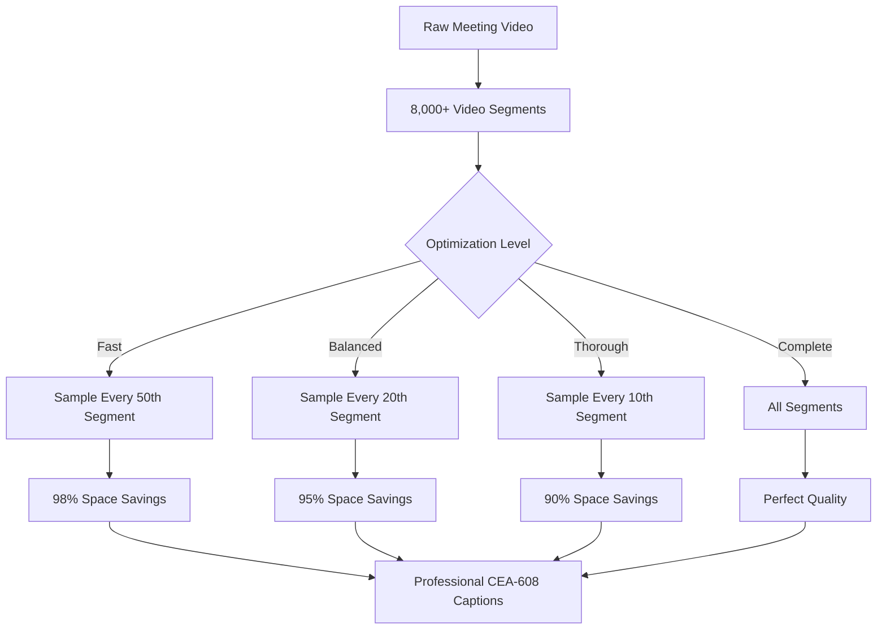
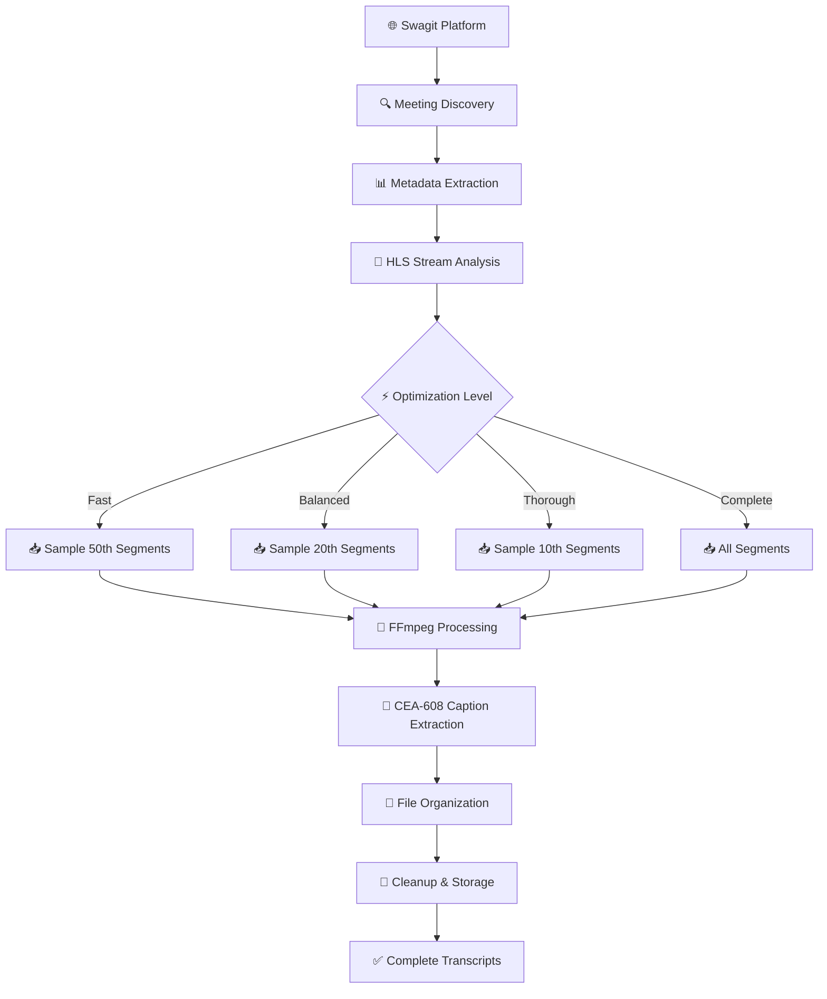
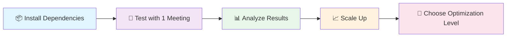

# MCPS Board Meeting Scraper

A comprehensive system for downloading Montgomery County Public Schools Board of Education meetings with complete transcripts and subtitles. This tool addresses the challenge of accessing and archiving public meeting content by extracting professional-quality captions from live-streamed board meetings.

## What This Project Does

The Montgomery County Public Schools Board of Education conducts regular meetings that are streamed live and archived on the Swagit video platform. While these meetings are publicly accessible, there's no easy way to search through hours of content or extract transcripts for research purposes. This project solves that problem by automatically downloading meetings and extracting embedded closed captions that provide professional-quality transcripts.

### 🎯 Core Capabilities

- **📄 Complete Transcripts**: Full subtitles covering entire meeting durations (typically 2-11+ hours each)
- **📊 Rich Metadata**: Comprehensive meeting details including dates, titles, committee information, and duration
- **📋 Meeting Agendas**: Automatic download of PDF agendas when available
- **🔄 Smart Resume**: Robust progress tracking with resumable downloads
- **⚡ Optimized Processing**: Multiple optimization levels offering up to 95% space savings
- **🏆 Professional Quality**: Uses embedded CEA-608 captions that comply with accessibility standards

## The Challenge We Solved

Board meetings are lengthy, often running 6-11 hours, and contain thousands of video segments. A typical meeting consists of approximately 8,000 video segments at 550KB each, totaling about 4.4GB of high-definition video data per meeting. While this might seem excessive, it's actually reasonable for professional-quality 1280x720 HD video at broadcast bitrates.

### 💡 Our Solution Strategy



The real breakthrough came from developing smart optimization strategies that maintain transcript quality while dramatically reducing resource requirements. Instead of downloading every video segment, our optimized approach samples segments at strategic intervals, maintaining temporal distribution across the entire meeting while reducing download times and storage requirements by up to 95%.

## Quick Start Guide

Before getting started, ensure you have the required dependencies:

### 📋 Prerequisites

- **Node.js** (version 16+ recommended)
- **FFmpeg** (for video processing)
- **Git** (for cloning the repository)

### 🚀 Installation

```bash
# Clone the repository
git clone git@github.com:thedjpetersen/mcps-meeting-scraper.git
cd mcps-meeting-scraper

# Install dependencies
npm install
```

### Recommended Approach: Optimized Downloads

For most users, we recommend starting with the optimized download approach, which provides excellent quality while being much more practical in terms of time and storage requirements.

To download 10 meetings with balanced optimization, which provides very good coverage of meeting content while using only about 200MB per meeting and taking approximately 5 minutes per meeting to process:

```bash
tsx fetchMCPSOptimized.ts 10 balanced
```

For users who need to process many meetings quickly or have limited storage, the fast mode downloads 100 meetings efficiently, using only about 80MB per meeting and processing each meeting in approximately 2 minutes:

```bash
tsx fetchMCPSOptimized.ts 100 fast
```

Researchers or users who need comprehensive coverage should consider the thorough mode for high-quality downloads, which provides excellent meeting coverage using about 400MB per meeting and processing each meeting in approximately 10 minutes:

```bash
tsx fetchMCPSOptimized.ts 50 thorough
```

### Complete Downloads (Resource Intensive)

For users who need perfect transcript quality and have significant time and storage resources available, the complete download option processes every video segment. This approach requires substantial resources but provides verbatim transcripts of entire meetings.

A single complete meeting download takes approximately 45 minutes and uses about 4GB of temporary space:

```bash
tsx fetchMCPSComplete.ts 1
```

For processing multiple complete meetings, expect significant time and storage requirements - 10 meetings will take approximately 7.5 hours and require 40GB of temporary space:

```bash
tsx fetchMCPSComplete.ts 10
```

### Analyzing Results

After downloading meetings, you can analyze the subtitle quality and coverage using our analysis tools:

```bash
tsx analyzeSubtitles.ts
```

For detailed information about optimization strategies and performance comparisons, review the optimization guide:

```bash
cat OPTIMIZATION_GUIDE.md
```

## Understanding Optimization Levels

The project offers four distinct optimization levels, each designed for different use cases and resource constraints.

### 📊 Optimization Comparison

| Level | Sample Rate | 💾 Storage | ⏱️ Time | 🎯 Quality | 🎯 Best For |
|-------|-------------|-----------|---------|-----------|------------|
| 🚀 **Fast** | Every 50th | ~80MB | ~2 min | 70% | Quick overviews, news |
| ⭐ **Balanced** | Every 20th | ~200MB | ~5 min | 85% | Most research needs |
| 🎓 **Thorough** | Every 10th | ~400MB | ~10 min | 95% | Academic research |
| 📋 **Complete** | All segments | ~4GB | ~45 min | 100% | Official archives |

### 🎯 Detailed Breakdown

#### 🚀 Fast Mode
- **Sample Rate**: Every 50th video segment
- **Storage**: ~80MB per meeting
- **Processing Time**: ~2 minutes
- **Coverage**: Good coverage of major topics and decisions
- **Ideal For**:
  - 📰 News reporting and quick summaries
  - 🔍 Finding specific discussion topics
  - 📱 Limited storage environments
  - ⚡ Rapid content overview

#### ⭐ Balanced Mode (Recommended)
- **Sample Rate**: Every 20th video segment  
- **Storage**: ~200MB per meeting
- **Processing Time**: ~5 minutes
- **Coverage**: Very good coverage capturing all major discussions
- **Ideal For**:
  - 🔬 General research and policy tracking
  - 🏛️ Community engagement and civic monitoring
  - 📊 Board decision analysis
  - 🎯 Most everyday use cases

#### 🎓 Thorough Mode
- **Sample Rate**: Every 10th video segment
- **Storage**: ~400MB per meeting
- **Processing Time**: ~10 minutes  
- **Coverage**: Excellent coverage with comprehensive discussion capture
- **Ideal For**:
  - 📚 Academic research and detailed analysis
  - ⚖️ Legal analysis and compliance review
  - 📈 Detailed policy studies
  - 🔍 Situations where context matters

#### 📋 Complete Mode
- **Sample Rate**: All video segments (no sampling)
- **Storage**: ~4GB per meeting
- **Processing Time**: ~45 minutes
- **Coverage**: Perfect transcription with every spoken word
- **Ideal For**:
  - 🏛️ Official archives and legal documentation
  - ⚖️ Legal proceedings requiring complete records
  - 📋 Situations requiring verbatim transcripts
  - 🎯 Maximum accuracy requirements

## How the Technology Works

The system operates through several sophisticated stages that together provide reliable, high-quality transcript extraction from live-streamed meetings.

### 🔄 Processing Pipeline



### 🔍 Meeting Discovery and Metadata Extraction

The process begins by scanning the Swagit video platform where MCPS hosts their meeting recordings. The system:

- **🎯 Identifies Available Meetings**: Automatically discovers all archived meetings
- **📊 Extracts Rich Metadata**: Captures titles, dates, committee information, and duration
- **📋 Finds Agenda Links**: Locates PDF agendas when available
- **🔄 Enables Auto-Updates**: New meetings are automatically included in processing queues

### 🎥 Stream Analysis and Download Strategy

Once meetings are identified, the system analyzes the HLS (HTTP Live Streaming) video streams:

- **📐 Structural Analysis**: Each meeting video is composed of thousands of small segments (typically 5 seconds each)
- **🎯 Smart Sampling**: Optimization algorithms determine which segments to download based on quality level
- **⏰ Temporal Distribution**: Ensures coverage across the entire meeting timeline
- **⚡ Efficient Processing**: Reduces download requirements while maintaining content quality

### 📝 Caption Extraction and Processing

The downloaded video segments contain embedded CEA-608 closed captions:

- **🏆 Professional Quality**: CEA-608 captions comply with accessibility standards
- **🔧 FFmpeg Processing**: Advanced video processing extracts captions accurately  
- **📄 Standard Format**: Converts to SRT subtitle format for universal compatibility
- **🎯 Higher Accuracy**: Superior to speech-to-text alternatives with precise timing

### 📁 File Organization and Cleanup

Processed content is organized systematically:

- **🗂️ Clear Directory Structure**: Labeled folders for easy navigation
- **📊 Comprehensive Metadata**: JSON files with meeting details and processing info
- **📋 Agenda Integration**: PDF agendas included when available
- **🧹 Automatic Cleanup**: Removes temporary video files, keeps essential transcripts
- **💾 Storage Efficiency**: Optimizes disk usage for large-scale processing

### 🔄 Progress Tracking and Recovery

Robust reliability features ensure successful processing:

- **📈 Progress Monitoring**: Detailed tracking of completed meetings
- **🔄 Resume Capability**: Interrupted downloads can resume from where they stopped
- **📋 Skip Completed**: Previously processed content is automatically skipped
- **🛡️ Error Handling**: Network issues and system problems are handled gracefully
- **📊 Status Reporting**: Clear progress indicators and completion summaries

## Project Architecture and Output Structure

The system generates organized output directories that make it easy to navigate and utilize the extracted content.

### 📁 Directory Structure

```
📦 mcps-meeting-scraper/
├── 📄 README.md                          # This comprehensive guide
├── 📄 OPTIMIZATION_GUIDE.md              # Detailed optimization strategies  
├── 📄 CLAUDE.md                          # Technical documentation
├── 📄 package.json                       # Project dependencies
├── 📄 .gitignore                         # Git ignore rules
├── 🔧 fetchMCPSOptimized.ts             # ⭐ Main optimized script
├── 🔧 fetchMCPSComplete.ts              # Complete download script
├── 🔧 analyzeSubtitles.ts               # Analysis tools
└── 📁 Output Directories/
    ├── 📂 mcps-optimized-meetings/       # Optimized downloads (recommended)
    │   ├── 📄 .progress.json             # Resume tracking
    │   ├── 📄 optimization_summary.txt   # Performance report
    │   └── 📂 [Meeting Folders]/
    │       ├── 📄 metadata.json          # Meeting details + optimization info
    │       └── 📄 captions.srt           # Extracted subtitles
    └── 📂 mcps-meetings-complete/        # Complete downloads (resource intensive)
        ├── 📄 .progress.json             # Resume tracking  
        ├── 📄 summary.txt                # Download summary
        └── 📂 [Meeting Folders]/
            ├── 📄 metadata.json          # Comprehensive meeting details
            ├── 📄 agenda.pdf              # Meeting agenda (when available)
            └── 📄 captions_complete.srt   # Complete meeting transcripts
```

### 🎯 Output Organization

#### For Optimized Downloads (`mcps-optimized-meetings/`)
- **📈 Progress Tracking**: Resumable downloads with detailed completion status
- **📊 Performance Reports**: Optimization summaries and space savings metrics
- **📁 Meeting Folders**: Organized by date and meeting title for easy navigation
- **📄 Metadata Files**: JSON format with meeting details and optimization information
- **📝 Subtitle Files**: Standard SRT format for universal compatibility

#### For Complete Downloads (`mcps-meetings-complete/`)
- **🔄 Full Progress Tracking**: Comprehensive status for long-running operations
- **📋 Agenda Integration**: PDF agendas automatically downloaded when available  
- **📄 Complete Transcripts**: Verbatim meeting transcriptions covering entire duration
- **🏆 Maximum Quality**: Perfect transcript quality for official documentation

## Performance Analysis and Resource Planning

Understanding the performance characteristics of different optimization levels helps users choose the most appropriate approach for their needs.

### Storage Requirements

Complete downloads require substantial storage, with each meeting using approximately 4GB during processing and generating transcript files of about 100MB. This storage requirement reflects the high-definition video quality and extensive meeting durations. In contrast, balanced optimization reduces storage requirements to approximately 200MB per meeting during processing, representing a 95% reduction while maintaining excellent transcript quality.

### Processing Time Considerations

Time requirements vary dramatically between optimization levels. Complete downloads require approximately 45 minutes per meeting, making them suitable for overnight processing or dedicated processing sessions. Balanced optimization reduces processing time to approximately 5 minutes per meeting, making it practical for regular use and large-scale processing projects.

### Network Usage and Reliability

Network requirements depend on the chosen optimization level, ranging from 80MB to 4GB per meeting. The system includes robust error handling and automatic retry logic to handle network interruptions gracefully. All downloads are resumable, so temporary network issues don't require restarting the entire process.

## Quality Assessment and Use Cases

Different optimization levels serve distinct use cases, and understanding these helps users select the most appropriate approach.

### General Research and Community Engagement

Most users will find balanced mode optimal for general research, policy tracking, and community engagement purposes. This mode captures all major discussions and board decisions while maintaining practical resource requirements. The resulting transcripts provide excellent coverage of meeting content with searchable text that facilitates finding specific topics or decisions.

### Professional and Academic Research

Researchers conducting detailed analysis may prefer thorough mode, which provides comprehensive discussion coverage suitable for academic research, legal analysis, or detailed policy studies. The near-complete transcript coverage ensures that important context and nuanced discussions are preserved.

### Official Documentation and Legal Requirements

Organizations requiring complete meeting documentation should use complete mode, which provides verbatim transcripts suitable for legal proceedings, official archives, or situations requiring perfect documentation. This mode ensures that every spoken word is captured and transcribed.

### News and Quick Reference

Media professionals and others needing quick access to key meeting highlights will find fast mode sufficient for news reporting, quick summaries, and finding specific discussion topics. While some brief exchanges may be missed, all major agenda items and key discussions are preserved.

## Getting Started with Your First Download

For new users, we recommend starting with a small test to understand the system's capabilities and requirements.

### 🚀 First-Time User Guide



#### Step 1: Quick Test Run 🧪
Start with a single meeting to familiarize yourself with the process:

```bash
# Download 1 meeting with balanced optimization (~5 minutes, ~200MB)
tsx fetchMCPSOptimized.ts 1 balanced
```

#### Step 2: Analyze Your Results 📊
Examine the output to understand transcript quality:

```bash
# Review what was downloaded
tsx analyzeSubtitles.ts

# Check the output directory
ls -la mcps-optimized-meetings/
```

#### Step 3: Scale Based on Your Needs 📈

```bash
# For quick content overview (recommended for beginners)
tsx fetchMCPSOptimized.ts 5 fast

# For comprehensive research (recommended for most users)  
tsx fetchMCPSOptimized.ts 10 balanced

# For detailed analysis (recommended for researchers)
tsx fetchMCPSOptimized.ts 5 thorough
```

### 🎯 Choosing Your Path

- **🚀 Fast Start**: Want to try it quickly? Use fast mode for immediate results
- **⭐ Balanced Approach**: Most users should start with balanced mode for optimal quality/efficiency
- **🎓 Research Focus**: Academic or detailed analysis? Choose thorough mode
- **📋 Complete Archive**: Need perfect transcripts? Use complete mode (resource intensive)

### 🛡️ Confidence Features

The system includes comprehensive error handling and progress tracking, so you can experiment with confidence:

- **🔄 Resume Capability**: Interrupted downloads automatically resume
- **📊 Progress Tracking**: Clear indicators show completion status  
- **🛡️ Error Recovery**: Network issues are handled gracefully
- **📈 Scalable Processing**: Start small, scale up as needed

Once you're comfortable with the basic operation, you can scale up to larger downloads or adjust optimization levels based on your specific requirements.