# MCPS Board Meeting Scraper

A comprehensive system for downloading Montgomery County Public Schools Board of Education meetings with complete transcripts and subtitles. This tool addresses the challenge of accessing and archiving public meeting content by extracting professional-quality captions from live-streamed board meetings.

## What This Project Does

The Montgomery County Public Schools Board of Education conducts regular meetings that are streamed live and archived on the Swagit video platform. While these meetings are publicly accessible, there's no easy way to search through hours of content or extract transcripts for research purposes. This project solves that problem by automatically downloading meetings and extracting embedded closed captions that provide professional-quality transcripts.

### 🎯 Core Capabilities

- **📄 Complete Transcripts**: Full subtitles covering entire meeting durations (typically 2-11+ hours each)
- **📊 Rich Metadata**: Comprehensive meeting details including dates, titles, committee information, and duration
- **📋 Meeting Agendas**: Automatic download of PDF agendas when available
- **🔄 Smart Resume**: Robust progress tracking with resumable downloads
- **⚡ Optimized Processing**: Multiple optimization levels offering up to 95% space savings
- **🏆 Professional Quality**: Uses embedded CEA-608 captions that comply with accessibility standards

## The Challenge We Solved

Board meetings are lengthy, often running 6-11 hours, and contain thousands of video segments. A typical meeting consists of approximately 8,000 video segments at 550KB each, totaling about 4.4GB of high-definition video data per meeting. While this might seem excessive, it's actually reasonable for professional-quality 1280x720 HD video at broadcast bitrates.

### 💡 Our Solution Strategy


The real breakthrough came from developing smart optimization strategies that maintain transcript quality while dramatically reducing resource requirements. Instead of downloading every video segment, our optimized approach samples segments at strategic intervals, maintaining temporal distribution across the entire meeting while reducing download times and storage requirements by up to 95%.

## Quick Start Guide

Before getting started, ensure you have the required dependencies:

### 📋 Prerequisites

- **Node.js** (version 16+ recommended)
- **FFmpeg** (for video processing)
- **Git** (for cloning the repository)

### 🚀 Installation

```bash
# Clone the repository
git clone git@github.com:thedjpetersen/mcps-meeting-scraper.git
cd mcps-meeting-scraper

# Install dependencies
npm install
```

### Recommended Approach: Optimized Downloads

For most users, we recommend starting with the optimized download approach, which provides excellent quality while being much more practical in terms of time and storage requirements.

#### 🎯 Balanced Mode Example (Recommended)

Download 10 meetings with balanced optimization - provides very good coverage using only about 200MB per meeting and 5 minutes processing time:

```bash
tsx fetchMCPSOptimized.ts 10 balanced
```

**Expected Output:**
```
🚀 MCPS Optimized Meeting Downloader
===================================
  Meetings: 10
  Mode: Balanced (Sample Every 20th Segment)
  Space per meeting: ~200MB per meeting
  Time per meeting: ~5 minutes per meeting
  Quality: Very good coverage, minimal content loss
  Total estimate: 50 minutes

🔍 Fetching meeting list...
📊 Found 683 meetings

[1/10] Processing meeting 346546...
  📅 Jun 24, 2025 - Jun 24, 2025 Business Meeting Agenda
    📥 Using Balanced (Sample Every 20th Segment)...
    📊 Expected: ~200MB per meeting, ~5 minutes per meeting
    🔬 Sampling 25 of 500 segments
    🔧 Processing 25 segments...
    📝 Extracting captions...
    ✅ Extracted 85KB (02:17:23 duration)
  ✅ Completed
```

#### ⚡ Fast Mode Example

For users who need to process many meetings quickly or have limited storage:

```bash
tsx fetchMCPSOptimized.ts 100 fast
```

**What You Get:**
- **Processing Time**: ~200 minutes total (2 min per meeting)
- **Storage Required**: ~8GB total (80MB per meeting)
- **Coverage**: Good overview of major decisions and topics
- **Best For**: News reporting, quick analysis, finding specific topics

#### 🎓 Thorough Mode Example

Researchers who need comprehensive coverage should use thorough mode:

```bash
tsx fetchMCPSOptimized.ts 50 thorough
```

**Research Benefits:**
- **Processing Time**: ~500 minutes total (10 min per meeting)
- **Storage Required**: ~20GB total (400MB per meeting)
- **Coverage**: Excellent discussion coverage with minimal gaps
- **Best For**: Academic research, policy analysis, detailed studies

### YouTube Download Method (Fast & Efficient)

For a much faster and more efficient approach, you can download meeting transcripts directly from the MCPS YouTube channel using yt-dlp. This method is significantly faster than downloading from the Swagit platform and uses less bandwidth.

#### 🎥 YouTube Download Example

```bash
# Download subtitles from 10 most recent board meetings on YouTube
tsx fetchMCPSYouTube.ts 10
```

**Expected Process:**
```
MCPS YouTube Subtitle Downloader
================================
Limiting to 10 videos
Fetching video list from MCPS YouTube channel...
Found 1872 total videos, 41 are board meetings

[1/10] Processing...

Downloading subtitles for: 6/24/25 Board of Education - Board Business Meeting
Video ID: pchI3okWbTI
✅ Downloaded 2 subtitle file(s):
   - pchI3okWbTI_62425_Board_of_Education.en-orig.vtt
   - pchI3okWbTI_62425_Board_of_Education.en.vtt
```

**Advantages of YouTube Method:**
- **⚡ Much Faster**: Downloads complete in seconds vs 30-60 minutes
- **💾 Minimal Storage**: Only subtitle files, no video segments
- **🔄 Auto-Generated Captions**: YouTube provides auto-generated subtitles
- **📊 Easy Filtering**: Automatically filters for board meetings only
- **🎯 Direct Access**: No need to process video segments

**Output Structure:**
```
📂 youtube_subs/
├── 📄 youtube_metadata.json          # Tracking of downloaded videos
└── 📄 [VideoID]_[Title].en.vtt      # Subtitle files in WebVTT format
```

### Complete Downloads (Resource Intensive)

For users who need perfect transcript quality and have significant time and storage resources available, the complete download option processes every video segment. This approach requires substantial resources but provides verbatim transcripts of entire meetings.

#### 📋 Single Complete Meeting Example

Perfect for testing the complete download process:

```bash
tsx fetchMCPSComplete.ts 1
```

**Expected Process:**
```
📋 MCPS Complete Board Meeting Downloader
  Max meetings: 1
  Mode: COMPLETE DOWNLOAD (all segments + full subtitles)
  Output directory: mcps-meetings-complete
  ⚠️  WARNING: This will download COMPLETE meetings (6000-8000 segments each)
  📊 Expected: 2-8 GB per meeting, 30-60 minutes per meeting
  🕐 Total time estimate: 45 minutes for 1 meetings

[1/1] Processing meeting 346546...
  📅 Jun 24, 2025 - Jun 24, 2025 Business Meeting Agenda
  🏛️  Board of Education
    🎥 Downloading ALL video segments for complete subtitles...
    ⚠️  This may take 30-60 minutes per meeting and use several GB of space
📥 Downloading 8281 of 8281 segments...
  Progress: 0/8281 segments
  Progress: 100/8281 segments
  Progress: 200/8281 segments
  ...
  Progress: 8200/8281 segments
✅ Downloaded all segments to subs/
    📁 Moving 8281 files to meeting directory...
    🔧 Concatenating all video segments...
    ⏳ This may take 10-20 minutes...
    📝 Extracting complete subtitles...
    ⏳ This may take 5-15 minutes...
    🔧 Trying extraction method 1...
    ✅ Successfully extracted 2847KB of complete subtitles!
    📊 Complete duration: 11:47:32
    🧹 Cleaning up video files to save space...
  ✅ Completed
```

#### 🗄️ Batch Complete Downloads

For processing multiple complete meetings (requires significant resources):

```bash
tsx fetchMCPSComplete.ts 10
```

**Resource Requirements:**
- **Total Time**: ~7.5 hours (45 minutes per meeting)
- **Peak Storage**: ~40GB (4GB per meeting during processing)
- **Final Storage**: ~10GB (transcripts and metadata only)
- **Network Usage**: ~40GB download
- **Best For**: Official archives, legal documentation, complete research datasets

### Analyzing Results

After downloading meetings, you can analyze the subtitle quality and coverage using our comprehensive analysis tools.

#### 📊 Subtitle Quality Analysis

```bash
tsx analyzeSubtitles.ts
```

**Example Analysis Output:**
```
📊 MCPS Meeting Subtitles Analysis

Total meetings analyzed: 15
Meetings with subtitles: 15
Meetings without subtitles: 0

Meeting Details:
================

📁 Jun-24-2025_business_meeting_agenda_346546
   ✅ Has subtitles
   📏 Size: 85KB (1,247 lines)
   ⏱️  Duration: 2h 17m 23s
   🕐 Time range: 00:00:11,512 to 02:17:23,477
   💬 End content: "Motion to approve the fiscal year 2026 operating budget..."

📁 Jun-10-2025_business_meeting_agenda_345210  
   ✅ Has subtitles
   📏 Size: 127KB (1,891 lines)
   ⏱️  Duration: 3h 45m 12s
   🕐 Time range: 00:00:10,110 to 03:45:12,672
   💬 End content: "Thank you all for attending tonight's meeting..."

📊 Summary by Optimization Level:
  🚀 Fast Mode: Average 23 minutes coverage per meeting
  ⭐ Balanced Mode: Average 2.5 hours coverage per meeting  
  🎓 Thorough Mode: Average 5.2 hours coverage per meeting
  📋 Complete Mode: Average 8.7 hours coverage per meeting

✨ Optimization complete! You saved 95% space and 89% time.
```

#### 🔍 Content Quality Examples

Review specific meeting content to understand transcript quality:

```bash
# Check a specific meeting's content
head -50 mcps-optimized-meetings/Jun-24-2025_*/captions.srt

# Search for specific topics across all meetings  
grep -r "budget" mcps-optimized-meetings/*/captions.srt

# Find meetings discussing specific policies
grep -r "transportation policy" mcps-optimized-meetings/*/captions.srt
```

#### 📈 Performance Analysis

For detailed optimization strategies and performance comparisons:

```bash
cat OPTIMIZATION_GUIDE.md
```

#### 🗂️ Directory Structure Inspection

```bash
# View organized meeting structure
tree mcps-optimized-meetings/ -L 2

# Check meeting metadata
cat mcps-optimized-meetings/Jun-24-2025_*/metadata.json | jq '.'

# List all downloaded meetings with sizes
du -sh mcps-optimized-meetings/*/ | sort -hr
```

## Understanding Optimization Levels

The project offers four distinct optimization levels, each designed for different use cases and resource constraints.

### 📊 Optimization Comparison

| Level | Sample Rate | 💾 Storage | ⏱️ Time | 🎯 Quality | 🎯 Best For |
|-------|-------------|-----------|---------|-----------|------------|
| 🚀 **Fast** | Every 50th | ~80MB | ~2 min | 70% | Quick overviews, news |
| ⭐ **Balanced** | Every 20th | ~200MB | ~5 min | 85% | Most research needs |
| 🎓 **Thorough** | Every 10th | ~400MB | ~10 min | 95% | Academic research |
| 📋 **Complete** | All segments | ~4GB | ~45 min | 100% | Official archives |

### 🎯 Detailed Breakdown

#### 🚀 Fast Mode
- **Sample Rate**: Every 50th video segment
- **Storage**: ~80MB per meeting
- **Processing Time**: ~2 minutes
- **Coverage**: Good coverage of major topics and decisions
- **Ideal For**:
  - 📰 News reporting and quick summaries
  - 🔍 Finding specific discussion topics
  - 📱 Limited storage environments
  - ⚡ Rapid content overview

#### ⭐ Balanced Mode (Recommended)
- **Sample Rate**: Every 20th video segment  
- **Storage**: ~200MB per meeting
- **Processing Time**: ~5 minutes
- **Coverage**: Very good coverage capturing all major discussions
- **Ideal For**:
  - 🔬 General research and policy tracking
  - 🏛️ Community engagement and civic monitoring
  - 📊 Board decision analysis
  - 🎯 Most everyday use cases

#### 🎓 Thorough Mode
- **Sample Rate**: Every 10th video segment
- **Storage**: ~400MB per meeting
- **Processing Time**: ~10 minutes  
- **Coverage**: Excellent coverage with comprehensive discussion capture
- **Ideal For**:
  - 📚 Academic research and detailed analysis
  - ⚖️ Legal analysis and compliance review
  - 📈 Detailed policy studies
  - 🔍 Situations where context matters

#### 📋 Complete Mode
- **Sample Rate**: All video segments (no sampling)
- **Storage**: ~4GB per meeting
- **Processing Time**: ~45 minutes
- **Coverage**: Perfect transcription with every spoken word
- **Ideal For**:
  - 🏛️ Official archives and legal documentation
  - ⚖️ Legal proceedings requiring complete records
  - 📋 Situations requiring verbatim transcripts
  - 🎯 Maximum accuracy requirements

## How the Technology Works

The system operates through several sophisticated stages that together provide reliable, high-quality transcript extraction from live-streamed meetings.

### 🔄 Processing Pipeline

```mermaid
flowchart TD
    A[🌐 Swagit Platform] --> B[🔍 Meeting Discovery]
    B --> C[📊 Metadata Extraction]
    C --> D[🎥 HLS Stream Analysis]
    D --> E{⚡ Optimization Level}
    E -->|Fast| F[📥 Sample 50th Segments]
    E -->|Balanced| G[📥 Sample 20th Segments]
    E -->|Thorough| H[📥 Sample 10th Segments]
    E -->|Complete| I[📥 All Segments]
    F --> J[🔧 FFmpeg Processing]
    G --> J
    H --> J
    I --> J
    J --> K[📝 CEA-608 Caption Extraction]
    K --> L[📁 File Organization]
    L --> M[🧹 Cleanup & Storage]
    M --> N[✅ Complete Transcripts]
```



### 🔍 Meeting Discovery and Metadata Extraction

The process begins by scanning the Swagit video platform where MCPS hosts their meeting recordings. The system:

- **🎯 Identifies Available Meetings**: Automatically discovers all archived meetings
- **📊 Extracts Rich Metadata**: Captures titles, dates, committee information, and duration
- **📋 Finds Agenda Links**: Locates PDF agendas when available
- **🔄 Enables Auto-Updates**: New meetings are automatically included in processing queues

### 🎥 Stream Analysis and Download Strategy

Once meetings are identified, the system analyzes the HLS (HTTP Live Streaming) video streams:

- **📐 Structural Analysis**: Each meeting video is composed of thousands of small segments (typically 5 seconds each)
- **🎯 Smart Sampling**: Optimization algorithms determine which segments to download based on quality level
- **⏰ Temporal Distribution**: Ensures coverage across the entire meeting timeline
- **⚡ Efficient Processing**: Reduces download requirements while maintaining content quality

### 📝 Caption Extraction and Processing

The downloaded video segments contain embedded CEA-608 closed captions:

- **🏆 Professional Quality**: CEA-608 captions comply with accessibility standards
- **🔧 FFmpeg Processing**: Advanced video processing extracts captions accurately  
- **📄 Standard Format**: Converts to SRT subtitle format for universal compatibility
- **🎯 Higher Accuracy**: Superior to speech-to-text alternatives with precise timing

### 📁 File Organization and Cleanup

Processed content is organized systematically:

- **🗂️ Clear Directory Structure**: Labeled folders for easy navigation
- **📊 Comprehensive Metadata**: JSON files with meeting details and processing info
- **📋 Agenda Integration**: PDF agendas included when available
- **🧹 Automatic Cleanup**: Removes temporary video files, keeps essential transcripts
- **💾 Storage Efficiency**: Optimizes disk usage for large-scale processing

### 🔄 Progress Tracking and Recovery

Robust reliability features ensure successful processing:

- **📈 Progress Monitoring**: Detailed tracking of completed meetings
- **🔄 Resume Capability**: Interrupted downloads can resume from where they stopped
- **📋 Skip Completed**: Previously processed content is automatically skipped
- **🛡️ Error Handling**: Network issues and system problems are handled gracefully
- **📊 Status Reporting**: Clear progress indicators and completion summaries

## Project Architecture and Output Structure

The system generates organized output directories that make it easy to navigate and utilize the extracted content.

### 📁 Directory Structure

```
📦 mcps-meeting-scraper/
├── 📄 README.md                          # This comprehensive guide
├── 📄 OPTIMIZATION_GUIDE.md              # Detailed optimization strategies  
├── 📄 CLAUDE.md                          # Technical documentation
├── 📄 package.json                       # Project dependencies
├── 📄 .gitignore                         # Git ignore rules
├── 🔧 fetchMCPSOptimized.ts             # ⭐ Main optimized script
├── 🔧 fetchMCPSComplete.ts              # Complete download script
├── 🔧 analyzeSubtitles.ts               # Analysis tools
└── 📁 Output Directories/
    ├── 📂 mcps-optimized-meetings/       # Optimized downloads (recommended)
    │   ├── 📄 .progress.json             # Resume tracking
    │   ├── 📄 optimization_summary.txt   # Performance report
    │   └── 📂 [Meeting Folders]/
    │       ├── 📄 metadata.json          # Meeting details + optimization info
    │       └── 📄 captions.srt           # Extracted subtitles
    └── 📂 mcps-meetings-complete/        # Complete downloads (resource intensive)
        ├── 📄 .progress.json             # Resume tracking  
        ├── 📄 summary.txt                # Download summary
        └── 📂 [Meeting Folders]/
            ├── 📄 metadata.json          # Comprehensive meeting details
            ├── 📄 agenda.pdf              # Meeting agenda (when available)
            └── 📄 captions_complete.srt   # Complete meeting transcripts
```

### 🎯 Output Organization

#### For Optimized Downloads (`mcps-optimized-meetings/`)
- **📈 Progress Tracking**: Resumable downloads with detailed completion status
- **📊 Performance Reports**: Optimization summaries and space savings metrics
- **📁 Meeting Folders**: Organized by date and meeting title for easy navigation
- **📄 Metadata Files**: JSON format with meeting details and optimization information
- **📝 Subtitle Files**: Standard SRT format for universal compatibility

#### For Complete Downloads (`mcps-meetings-complete/`)
- **🔄 Full Progress Tracking**: Comprehensive status for long-running operations
- **📋 Agenda Integration**: PDF agendas automatically downloaded when available  
- **📄 Complete Transcripts**: Verbatim meeting transcriptions covering entire duration
- **🏆 Maximum Quality**: Perfect transcript quality for official documentation

## Performance Analysis and Resource Planning

Understanding the performance characteristics of different optimization levels helps users choose the most appropriate approach for their needs.

### Storage Requirements

Complete downloads require substantial storage, with each meeting using approximately 4GB during processing and generating transcript files of about 100MB. This storage requirement reflects the high-definition video quality and extensive meeting durations. In contrast, balanced optimization reduces storage requirements to approximately 200MB per meeting during processing, representing a 95% reduction while maintaining excellent transcript quality.

### Processing Time Considerations

Time requirements vary dramatically between optimization levels. Complete downloads require approximately 45 minutes per meeting, making them suitable for overnight processing or dedicated processing sessions. Balanced optimization reduces processing time to approximately 5 minutes per meeting, making it practical for regular use and large-scale processing projects.

### Network Usage and Reliability

Network requirements depend on the chosen optimization level, ranging from 80MB to 4GB per meeting. The system includes robust error handling and automatic retry logic to handle network interruptions gracefully. All downloads are resumable, so temporary network issues don't require restarting the entire process.

## 🛠️ Troubleshooting Guide

Common issues and their solutions with real examples:

### Download Interruptions

**Problem**: Download stops due to network issues
```
Error: FetchError: request to https://archive-stream.granicus.com/...media_3788.ts failed, reason: read ECONNRESET
```

**Solution**: Simply re-run the same command - progress is automatically saved
```bash
# Original command that failed
tsx fetchMCPSOptimized.ts 10 balanced

# Just run it again - it will skip completed meetings and resume
tsx fetchMCPSOptimized.ts 10 balanced
```

**Expected Resume Output:**
```
🚀 MCPS Optimized Meeting Downloader
  Previously completed: 3 meetings

[1/10] Skipping 346546 (completed)
[2/10] Skipping 345210 (completed)  
[3/10] Skipping 343697 (completed)
[4/10] Processing meeting 342093...
```

### Disk Space Issues

**Problem**: Not enough space for downloads
```bash
# Check available space
df -h
Filesystem      Size  Used Avail Use% Mounted on
/dev/disk1s1   466G  445G   19G  96% /
```

**Solutions**:
```bash
# Option 1: Use fast mode for minimal space
tsx fetchMCPSOptimized.ts 100 fast  # Only ~8GB total

# Option 2: Process in smaller batches
tsx fetchMCPSOptimized.ts 5 balanced  # ~1GB per batch

# Option 3: Clean up previous downloads
rm -rf mcps-optimized-meetings/
```

### FFmpeg Issues

**Problem**: FFmpeg not found
```
Error: Command failed: ffmpeg -f lavfi...
/bin/sh: ffmpeg: command not found
```

**Solution**: Install FFmpeg
```bash
# macOS
brew install ffmpeg

# Ubuntu/Debian
sudo apt install ffmpeg

# Verify installation
ffmpeg -version
```

### Missing Dependencies

**Problem**: TypeScript or Node.js issues
```bash
# If tsx command not found
npm install -g tsx

# If Node.js version too old
node --version  # Should be 16+

# Install project dependencies
npm install
```

### Permission Issues

**Problem**: Cannot write to directory
```
Error: EACCES: permission denied, mkdir '/path/to/mcps-optimized-meetings'
```

**Solution**: Fix permissions or change location
```bash
# Fix permissions (if in your home directory)
chmod 755 ./mcps-optimized-meetings

# Or run from a directory you own
cd ~/Documents
git clone git@github.com:thedjpetersen/mcps-meeting-scraper.git
cd mcps-meeting-scraper
npm install
```

### Quality Verification

**Problem**: Want to verify transcript quality before large downloads

**Solution**: Test with single meeting first
```bash
# Test with one recent meeting
tsx fetchMCPSOptimized.ts 1 balanced

# Analyze the result
tsx analyzeSubtitles.ts

# Check the actual content
head -100 mcps-optimized-meetings/*/captions.srt
```

### Performance Optimization

**Problem**: Downloads too slow

**Solutions**:
```bash
# Use faster mode for quicker processing
tsx fetchMCPSOptimized.ts 10 fast  # 2min per meeting vs 5min

# Process smaller batches in parallel (advanced)
tsx fetchMCPSOptimized.ts 25 balanced &
tsx fetchMCPSOptimized.ts 25 balanced &  # Different meeting ranges
```

## Quality Assessment and Use Cases

Different optimization levels serve distinct use cases, and understanding these helps users select the most appropriate approach.

### General Research and Community Engagement

Most users will find balanced mode optimal for general research, policy tracking, and community engagement purposes. This mode captures all major discussions and board decisions while maintaining practical resource requirements. The resulting transcripts provide excellent coverage of meeting content with searchable text that facilitates finding specific topics or decisions.

### Professional and Academic Research

Researchers conducting detailed analysis may prefer thorough mode, which provides comprehensive discussion coverage suitable for academic research, legal analysis, or detailed policy studies. The near-complete transcript coverage ensures that important context and nuanced discussions are preserved.

### Official Documentation and Legal Requirements

Organizations requiring complete meeting documentation should use complete mode, which provides verbatim transcripts suitable for legal proceedings, official archives, or situations requiring perfect documentation. This mode ensures that every spoken word is captured and transcribed.

### News and Quick Reference

Media professionals and others needing quick access to key meeting highlights will find fast mode sufficient for news reporting, quick summaries, and finding specific discussion topics. While some brief exchanges may be missed, all major agenda items and key discussions are preserved.

## 💼 Real-World Usage Examples

### Example 1: Journalist Covering Education Policy

**Goal**: Quickly find recent discussions about school budget and transportation

```bash
# Download recent meetings quickly  
tsx fetchMCPSOptimized.ts 20 fast

# Search for budget discussions
grep -r -i "budget\|funding\|finance" mcps-optimized-meetings/*/captions.srt | head -10

# Find transportation policy mentions
grep -r -i "transport\|bus\|route" mcps-optimized-meetings/*/captions.srt
```

**Example Results**:
```
mcps-optimized-meetings/Jun-24-2025_business_meeting_agenda_346546/captions.srt:
00:45:23,150 --> 00:45:26,820
Motion to approve the fiscal year 2026 operating budget as proposed

mcps-optimized-meetings/May-22-2025_business_meeting_agenda_343697/captions.srt:
01:23:45,720 --> 01:23:48,940
The transportation budget will see a 12% increase this year
```

### Example 2: Parent Researching School Policies

**Goal**: Find discussions about specific schools or policies affecting their child

```bash
# Download comprehensive coverage
tsx fetchMCPSOptimized.ts 10 balanced

# Search for specific school mentions
grep -r -i "einstein high\|walt whitman\|bethesda" mcps-optimized-meetings/*/captions.srt

# Find policy discussions
grep -r -i "graduation requirement\|attendance policy" mcps-optimized-meetings/*/captions.srt

# Check meeting agendas for relevant topics
find mcps-optimized-meetings/ -name "agenda.pdf" -exec echo "Agenda: {}" \;
```

### Example 3: Academic Researcher

**Goal**: Comprehensive analysis of board decision-making patterns over time

```bash
# Download high-quality coverage for detailed analysis
tsx fetchMCPSOptimized.ts 50 thorough

# Analyze meeting participation patterns
grep -r "motion to\|second the motion\|vote" mcps-optimized-meetings/*/captions.srt | wc -l

# Extract all board member statements
grep -r "Dr\. \|Ms\. \|Mr\. " mcps-optimized-meetings/*/captions.srt > board_member_statements.txt

# Analyze decision outcomes
grep -r -i "motion passes\|motion fails\|approved\|denied" mcps-optimized-meetings/*/captions.srt
```

### Example 4: Legal Professional

**Goal**: Complete documentation for compliance review

```bash
# Download complete transcripts for legal accuracy
tsx fetchMCPSComplete.ts 5

# Verify complete coverage
tsx analyzeSubtitles.ts

# Export formatted transcripts
for meeting in mcps-meetings-complete/*/; do
  echo "Meeting: $(basename "$meeting")" >> legal_transcripts.txt
  cat "$meeting/captions_complete.srt" >> legal_transcripts.txt
  echo -e "\n---\n" >> legal_transcripts.txt
done
```

### Example 5: Data Analysis and Processing

**Goal**: Convert transcripts to structured data for analysis

```bash
# Download meetings with balanced optimization
tsx fetchMCPSOptimized.ts 25 balanced

# Convert SRT to plain text for analysis
for file in mcps-optimized-meetings/*/captions.srt; do
  # Remove SRT formatting and extract just the spoken content
  grep -v "^[0-9]*$" "$file" | \
  grep -v "^[0-9][0-9]:[0-9][0-9]:[0-9][0-9]" | \
  sed 's/<[^>]*>//g' > "${file%.srt}.txt"
done

# Create summary statistics
echo "Meeting Statistics:" > summary_stats.txt
echo "Total meetings: $(ls mcps-optimized-meetings/*/captions.srt | wc -l)" >> summary_stats.txt
echo "Total transcript lines: $(cat mcps-optimized-meetings/*/captions.txt | wc -l)" >> summary_stats.txt
echo "Most frequent topics:" >> summary_stats.txt
cat mcps-optimized-meetings/*/captions.txt | tr ' ' '\n' | tr '[:upper:]' '[:lower:]' | \
sort | uniq -c | sort -nr | head -20 >> summary_stats.txt
```

### Example 6: Automated Monitoring Setup

**Goal**: Regularly download and monitor new meetings

```bash
# Create a monitoring script
cat > monitor_meetings.sh << 'EOF'
#!/bin/bash
# Download any new meetings weekly
cd /path/to/mcps-meeting-scraper
tsx fetchMCPSOptimized.ts 5 balanced

# Send summary via email (if configured)
tsx analyzeSubtitles.ts > weekly_summary.txt
# mail -s "MCPS Meeting Summary" user@email.com < weekly_summary.txt
EOF

chmod +x monitor_meetings.sh

# Set up weekly cron job
echo "0 9 * * 1 /path/to/monitor_meetings.sh" | crontab -
```

## Getting Started with Your First Download

For new users, we recommend starting with a small test to understand the system's capabilities and requirements.

### 🚀 First-Time User Guide


#### Step 1: Quick Test Run 🧪
Start with a single meeting to familiarize yourself with the process:

```bash
# Download 1 meeting with balanced optimization (~5 minutes, ~200MB)
tsx fetchMCPSOptimized.ts 1 balanced
```

#### Step 2: Analyze Your Results 📊
Examine the output to understand transcript quality:

```bash
# Review what was downloaded
tsx analyzeSubtitles.ts

# Check the output directory
ls -la mcps-optimized-meetings/
```

#### Step 3: Scale Based on Your Needs 📈

```bash
# For quick content overview (recommended for beginners)
tsx fetchMCPSOptimized.ts 5 fast
# Expected: ~400MB total, ~10 minutes, good topic coverage

# For comprehensive research (recommended for most users)  
tsx fetchMCPSOptimized.ts 10 balanced
# Expected: ~2GB total, ~50 minutes, excellent coverage

# For detailed analysis (recommended for researchers)
tsx fetchMCPSOptimized.ts 5 thorough
# Expected: ~2GB total, ~50 minutes, near-complete coverage
```

**Real Example - After Running Balanced Mode:**

```bash
$ tsx fetchMCPSOptimized.ts 3 balanced
🚀 MCPS Optimized Meeting Downloader
===================================
  Meetings: 3
  Total estimate: 15 minutes

✅ Final Summary:
  ✅ Successful: 3
  ⏭️  Skipped: 0
  📁 Output: mcps-optimized-meetings/

$ ls -la mcps-optimized-meetings/
drwxr-xr-x  Jun-24-2025_business_meeting_agenda_346546/
drwxr-xr-x  Jun-10-2025_business_meeting_agenda_345210/  
drwxr-xr-x  May-22-2025_business_meeting_agenda_343697/
-rw-r--r--  optimization_summary.txt
-rw-r--r--  .progress.json

$ head -20 mcps-optimized-meetings/Jun-24-2025_*/captions.srt
1
00:00:11,512 --> 00:00:13,985
<font face="Monospace">{\an7}Good afternoon and welcome to</font>

2
00:00:13,985 --> 00:00:16,917
<font face="Monospace">{\an7}Good afternoon and welcome to
the June 24th, 2025 board closed</font>
```

### 🎯 Choosing Your Path

- **🚀 Fast Start**: Want to try it quickly? Use fast mode for immediate results
- **⭐ Balanced Approach**: Most users should start with balanced mode for optimal quality/efficiency
- **🎓 Research Focus**: Academic or detailed analysis? Choose thorough mode
- **📋 Complete Archive**: Need perfect transcripts? Use complete mode (resource intensive)

### 🛡️ Confidence Features

The system includes comprehensive error handling and progress tracking, so you can experiment with confidence:

- **🔄 Resume Capability**: Interrupted downloads automatically resume
- **📊 Progress Tracking**: Clear indicators show completion status  
- **🛡️ Error Recovery**: Network issues are handled gracefully
- **📈 Scalable Processing**: Start small, scale up as needed

Once you're comfortable with the basic operation, you can scale up to larger downloads or adjust optimization levels based on your specific requirements.